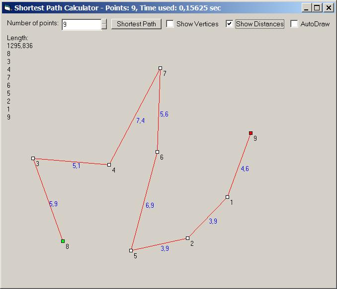



## Shortest Path Calculator \(Traveling Salesman \- Brute Force\)

### Description

TSP is a shortest path calculator, which means it find the shortest path in which

to go through a specific number of points. It uses the brute force technique, that

is finding all possible ways and selecting the shortest. Drag the points around and

hit 'Shortest Path'.
 
### More Info
 

             |
---                |---
**Submitted On**   |2002-10-06 08:28:04
**By**             |[Lars Holm Jensen](https://github.com/Planet-Source-Code/PSCIndex/blob/master/ByAuthor/lars-holm-jensen.md)
**Level**          |Intermediate
**User Rating**    |4.8 (19 globes from 4 users)
**Compatibility**  |VB 5\.0, VB 6\.0
**Category**       |[Math/ Dates](https://github.com/Planet-Source-Code/PSCIndex/blob/master/ByCategory/math-dates__1-37.md)
**World**          |[Visual Basic](https://github.com/Planet-Source-Code/PSCIndex/blob/master/ByWorld/visual-basic.md)
**Archive File**   |[Shortest\_P1413701062002\.zip](https://github.com/Planet-Source-Code/lars-holm-jensen-shortest-path-calculator-traveling-salesman-brute-force__1-39586/archive/master.zip)

